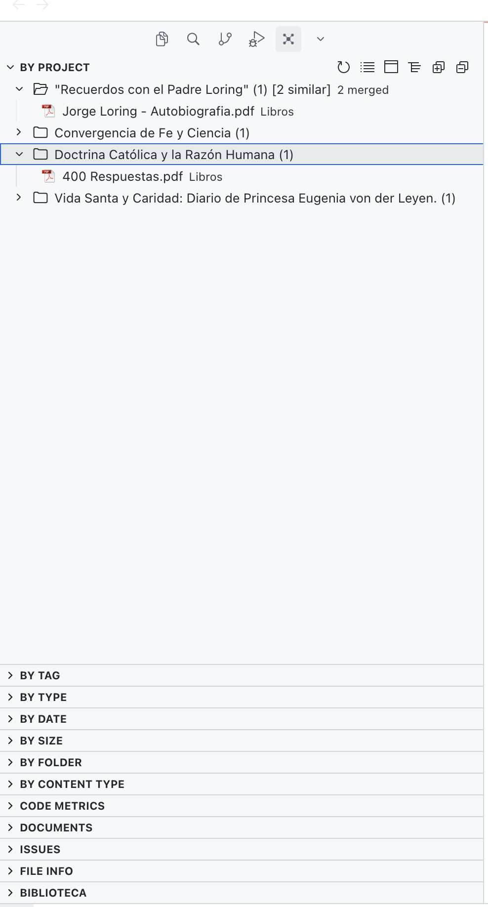
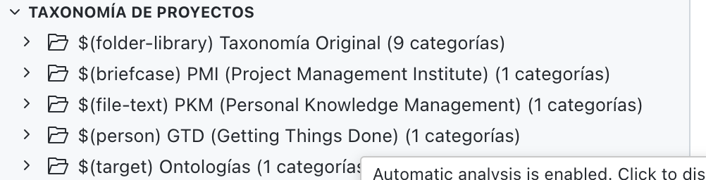

# Taxonomía de Proyectos - Naturaleza y Tipos

## Resumen Ejecutivo

Este documento propone la implementación de un sistema de taxonomía de proyectos que permita clasificar proyectos según su "naturaleza" o "tipo", facilitando el tratamiento diferenciado según sus características específicas.

## Investigación y Fundamentos

### Enfoques Académicos y de la Industria

Aunque no existe una taxonomía universalmente aceptada para proyectos personales y profesionales, varios enfoques proporcionan bases sólidas:


## Taxonomía Propuesta para Cortex

Basándonos en los casos de uso específicos mencionados, proponemos la siguiente taxonomía:

### Categorías Principales

#### 1. **Escritura y Creación**
- `writing.book` - Libro en escritura
- `writing.thesis` - Tesis de grado
- `writing.article` - Artículo académico o profesional
- `writing.documentation` - Documentación técnica
- `writing.blog` - Blog o publicación periódica

#### 2. **Colecciones y Bibliotecas**
- `collection.library` - Librería temática (conjunto de libros/documentos)
- `collection.archive` - Archivo histórico
- `collection.reference` - Referencia de consulta

#### 3. **Desarrollo y Tecnología**
- `development.software` - Proyecto de software
- `development.erp` - Sistema ERP
- `development.website` - Sitio web
- `development.api` - API o servicio

#### 4. **Gestión y Administración**
- `management.business` - Proyecto empresarial
- `management.personal` - Proyecto personal
- `management.family` - Proyecto familiar

#### 5. **Proyectos Multinivel**
- `hierarchical.parent` - Proyecto padre (contiene subproyectos)
- `hierarchical.child` - Subproyecto (pertenece a un proyecto padre)
- `hierarchical.portfolio` - Portafolio de proyectos relacionados

#### 6. **Compras y Adquisiciones**
- `purchase.vehicle` - Compra de vehículo
- `purchase.property` - Compra de propiedad
- `purchase.equipment` - Compra de equipo
- `purchase.service` - Contratación de servicio

#### 7. **Educación y Aprendizaje**
- `education.course` - Curso o programa educativo
- `education.research` - Investigación académica
- `education.school` - Gestión escolar (colegios, matrículas)

#### 8. **Eventos y Planificación**
- `event.wedding` - Boda
- `event.travel` - Viaje
- `event.conference` - Conferencia o evento profesional

#### 9. **Referencia y Consulta**
- `reference.knowledge_base` - Base de conocimiento
- `reference.template` - Plantillas y recursos reutilizables
- `reference.archive` - Archivo de referencia

### Atributos Adicionales

Cada tipo de proyecto puede tener atributos específicos que influyen en su tratamiento:

- **Temporalidad**: `temporary` (tiene fecha de finalización) vs `ongoing` (continuo)
- **Colaboración**: `individual` vs `team` vs `organization`
- **Prioridad**: `low`, `medium`, `high`, `critical`
- **Estado**: `planning`, `active`, `on-hold`, `completed`, `archived`
- **Visibilidad**: `private`, `shared`, `public`

## Implementación Propuesta

### 1. Estructura de Datos

```go
// ProjectNature representa la naturaleza/tipo de un proyecto
type ProjectNature string

const (
    // Escritura
    NatureWritingBook        ProjectNature = "writing.book"
    NatureWritingThesis      ProjectNature = "writing.thesis"
    NatureWritingArticle     ProjectNature = "writing.article"
    
    // Colecciones
    NatureCollectionLibrary   ProjectNature = "collection.library"
    NatureCollectionArchive   ProjectNature = "collection.archive"
    
    // Desarrollo
    NatureDevelopmentSoftware ProjectNature = "development.software"
    NatureDevelopmentERP      ProjectNature = "development.erp"
    
    // Gestión
    NatureManagementBusiness  ProjectNature = "management.business"
    NatureManagementPersonal  ProjectNature = "management.personal"
    NatureManagementFamily    ProjectNature = "management.family"
    
    // Jerárquico
    NatureHierarchicalParent  ProjectNature = "hierarchical.parent"
    NatureHierarchicalChild   ProjectNature = "hierarchical.child"
    
    // Compras
    NaturePurchaseVehicle    ProjectNature = "purchase.vehicle"
    NaturePurchaseProperty    ProjectNature = "purchase.property"
    
    // Educación
    NatureEducationCourse     ProjectNature = "education.course"
    NatureEducationSchool     ProjectNature = "education.school"
    
    // Eventos
    NatureEventTravel         ProjectNature = "event.travel"
    
    // Referencia
    NatureReferenceKnowledge  ProjectNature = "reference.knowledge_base"
    
    // Por defecto
    NatureGeneric            ProjectNature = "generic"
)

// ProjectAttributes contiene atributos adicionales del proyecto
type ProjectAttributes struct {
    Temporality  string // "temporary" | "ongoing"
    Collaboration string // "individual" | "team" | "organization"
    Priority     string // "low" | "medium" | "high" | "critical"
    Status       string // "planning" | "active" | "on-hold" | "completed" | "archived"
    Visibility   string // "private" | "shared" | "public"
    Metadata     map[string]interface{} // Metadatos específicos del tipo
}
```

### 2. Modificaciones a la Entidad Project

```go
type Project struct {
    ID          ProjectID
    WorkspaceID WorkspaceID
    Name        string
    Description string
    Nature      ProjectNature      // NUEVO: Naturaleza del proyecto
    Attributes  ProjectAttributes  // NUEVO: Atributos adicionales
    ParentID    *ProjectID
    Path        string
    CreatedAt   time.Time
    UpdatedAt   time.Time
}
```

### 3. Migración de Base de Datos

```sql
-- Agregar columna nature a la tabla projects
ALTER TABLE projects ADD COLUMN nature TEXT NOT NULL DEFAULT 'generic';

-- Agregar columna attributes (JSON) para atributos adicionales
ALTER TABLE projects ADD COLUMN attributes TEXT;

-- Crear índice para búsquedas por naturaleza
CREATE INDEX IF NOT EXISTS idx_projects_nature ON projects(workspace_id, nature);
```

### 4. Comportamientos Diferenciados por Naturaleza

Cada tipo de proyecto puede tener comportamientos específicos:

#### `writing.book` / `writing.thesis`
- Priorizar documentos de texto (`.md`, `.docx`, `.tex`)
- Sugerir estructura de capítulos
- Tracking de progreso de escritura
- Generación automática de índices

#### `collection.library`
- Agrupar por temas/tags automáticamente
- Vista de biblioteca con metadatos de libros
- Búsqueda semántica en contenido

#### `development.software` / `development.erp`
- Priorizar archivos de código
- Análisis de dependencias
- Tracking de issues y tareas técnicas

#### `hierarchical.parent`
- Vista consolidada de subproyectos
- Agregación de métricas de hijos
- Navegación jerárquica optimizada

#### `purchase.vehicle` / `purchase.property`
- Tracking de documentos legales
- Fechas importantes (inspecciones, pagos)
- Comparación de opciones

#### `education.school`
- Organización por niño/estudiante
- Tracking de documentos escolares
- Calendario académico

## Soluciones Open Source de Referencia

### 1. **ProjectLibre**
- Utiliza categorías de proyectos (Project Categories)
- Soporta jerarquías de proyectos
- **Aprendizaje**: Estructura de categorías predefinidas

### 2. **Odoo Project Module**
- Tipos de proyectos configurables
- Atributos personalizables por tipo
- **Aprendizaje**: Sistema extensible de tipos

### 3. **Redmine**
- Categorías de proyectos
- Campos personalizados por proyecto
- **Aprendizaje**: Flexibilidad en metadatos

### 4. **Obsidian**
- Tags y frontmatter para clasificación
- Plantillas por tipo de nota
- **Aprendizaje**: Sistema de metadatos flexible

## Beneficios de la Implementación

1. **Tratamiento Diferenciado**: Cada tipo de proyecto puede tener vistas, comandos y comportamientos específicos
2. **Mejor Organización**: Facilita la navegación y búsqueda de proyectos similares
3. **Automatización**: Permite reglas y sugerencias basadas en el tipo
4. **Métricas Específicas**: Tracking de progreso adaptado a cada naturaleza
5. **AI Mejorado**: El LLM puede usar el tipo para generar mejores sugerencias

## Próximos Pasos

1. ✅ Definir taxonomía inicial
2. ✅ Implementar campo `nature` en entidad Project
3. ✅ Crear migración de base de datos (versión 7)
4. ✅ Actualizar repositorios y servicios
5. ✅ Actualizar protobuf definitions y regenerar código
6. ⏳ Agregar UI para selección de naturaleza (VS Code extension)
7. ⏳ Implementar comportamientos específicos por tipo
8. ⏳ Documentar tipos disponibles y sus características en UI

## Estado de Implementación

### ✅ Completado

- **Entidad Project**: Agregados `ProjectNature` y `ProjectAttributes`
- **Base de Datos**: Migración versión 7 con campos `nature` y `attributes`
- **Repositorio**: Soporte completo para leer/escribir nature y attributes
- **Protobuf**: Definiciones actualizadas y código regenerado
- **Servicios**: `CreateProjectWithNature` implementado
- **Adaptadores gRPC**: Soporte completo en Create/Update/Get

### ⏳ Pendiente

- **UI en VS Code**: Selector de naturaleza al crear/editar proyectos
- **Comportamientos Específicos**: Lógica diferenciada por tipo de proyecto
- **Validación**: Reglas de validación según naturaleza
- **Vistas Especializadas**: Vistas optimizadas por tipo de proyecto
- **Métricas**: Tracking específico según naturaleza

## Ejemplos de Uso

### Crear un proyecto de tipo "libro"

```go
// Usando el servicio directamente
project, err := projectService.CreateProjectWithNature(
    ctx,
    workspaceID,
    "Mi Novela",
    "Una novela de ciencia ficción",
    nil, // sin padre
    entity.NatureWritingBook,
    &entity.ProjectAttributes{
        Temporality:   "temporary",
        Collaboration: "individual",
        Priority:      "high",
        Status:        "active",
        Visibility:    "private",
        Metadata: map[string]interface{}{
            "target_word_count": 80000,
            "genre": "sci-fi",
        },
    },
)
```

### Crear un proyecto jerárquico (colegio de hijos)

```go
// Proyecto padre
parent, err := projectService.CreateProjectWithNature(
    ctx,
    workspaceID,
    "Colegio de los Hijos",
    "Gestión escolar de Felipe y Luna",
    nil,
    entity.NatureHierarchicalParent,
    &entity.ProjectAttributes{
        Status: "active",
    },
)

// Subproyecto: Matrícula Felipe
child1, err := projectService.CreateProjectWithNature(
    ctx,
    workspaceID,
    "Matrícula Felipe",
    "Proceso de matrícula 2024",
    &parent.ID,
    entity.NatureEducationSchool,
    &entity.ProjectAttributes{
        Status: "active",
        Metadata: map[string]interface{}{
            "student_name": "Felipe",
            "year": 2024,
        },
    },
)
```

### Buscar proyectos por naturaleza

```sql
-- Todos los proyectos de escritura
SELECT * FROM projects 
WHERE workspace_id = ? AND nature LIKE 'writing.%';

-- Todos los proyectos de compra
SELECT * FROM projects 
WHERE workspace_id = ? AND nature LIKE 'purchase.%';
```

### Actualizar naturaleza de un proyecto

```go
project, err := projectRepo.Get(ctx, workspaceID, projectID)
if err != nil {
    return err
}

// Cambiar a proyecto completado
project.Nature = entity.NatureWritingBook
project.Attributes.Status = "completed"
project.Attributes.Metadata["completed_date"] = time.Now().Format("2006-01-02")

err = projectRepo.Update(ctx, workspaceID, project)
```

## Referencias

- PMI Project Management Body of Knowledge (PMBOK)
- Getting Things Done (GTD) - David Allen
- Personal Knowledge Management (PKM) methodologies
- Dublin Core Metadata Initiative
- Schema.org Project type definitions

